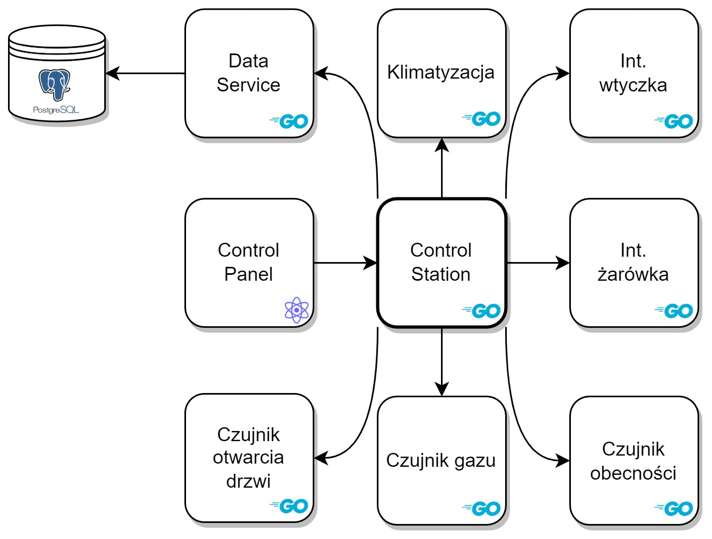
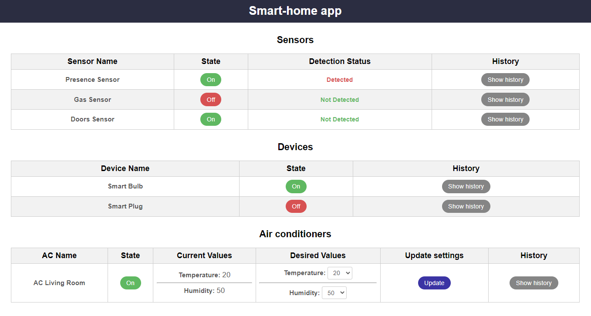

# Smart-home system

This project is part of my Engineering thesis. It's a smart-home system that allows controlling devices at home using a web app.

The system is based on a microservices architecture and consists of several services, which are described below.

## Services

### Sensors
- Czujnik otwarcia drzwi(door-opening sensor)
- Czujnik gazu(gas sensor)
- Czujnik obecności(prsence sensor)

The repo with sensors logic implementation is [here](https://github.com/pklimuk-eng-thesis/sensor).

### Smart devices
- Inteligentna żarówka(smart bulb)
- Inteligentna wtyczka(smart plug)

The repo with smart devices logic implementation is [here](https://github.com/pklimuk-eng-thesis/device).

### Air conditioning
- Klimatyzacja(air conditioning)

The repo with air conditioning logic implementation is [here](https://github.com/pklimuk-eng-thesis/air-conditioning).

### Data service
The service, which is responsible for data management. 

The code is [here](https://github.com/pklimuk-eng-thesis/data-service).

### Control station
The "brain" of the system. It's responsible for controlling the whole system.

The code is [here](https://github.com/pklimuk-eng-thesis/control-station).

### Control panel
The web app, which allows to control the whole system.

The code is [here](https://github.com/pklimuk-eng-thesis/control-panel).

The user home page is presented below.

